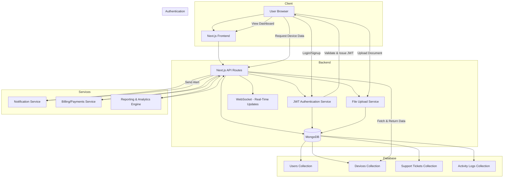

# 🖥️ IT Management System


---

## 📖 About The Project

**IT Management System** is a full-stack IT asset and user management platform that helps organizations securely manage employees, their assigned devices, and authentication. The platform offers **admin dashboards, secure login, device tracking, and project scalability**.  

Built using **Next.js, MongoDB, JWT, Zustand, and ShadCN UI**, this system ensures robust data handling, a modern responsive design, and **enterprise-ready security practices**.  

It is perfect for IT admins, HR teams, and organizations that need to manage large sets of users and their assets with precision.

---

## ✨ Key Features

- 🔑 **JWT Authentication**: Secure login and session handling with token expiry and ban mechanism.
- 👥 **User Management**: Create, edit, list, and delete users with support for pagination and search.
- 💻 **Device Tracking**: Assign devices to users, track multiple devices per employee, and monitor status.
- 🗑 **Soft Delete System**: Devices are not permanently deleted; instead, they are flagged and preserved for audit history.
- 🔒 **Admin Settings**: Update password, change username, and manage authentication settings.
- 🧭 **Search & Pagination**: Optimized for large datasets to ensure smooth browsing.
- 🖼 **Modern Responsive UI**: Built with TailwindCSS + ShadCN for an interactive and mobile-first design.
- ⚡ **State Management**: Managed with Zustand for predictable app-wide state handling.

---

## 📸 Screenshots

### Login Page


### Dashboard


### Search User


### Add User


### Device Management


### Admin Settings


### Change Name


### Change Password


---

## 🏗️ Architecture

The system follows a **client-server model** designed for performance, modularity, and scalability.  

- **Frontend (Next.js + TailwindCSS + ShadCN UI)**:
  - Renders the dashboard, forms, and settings.
  - Manages authentication state and client routing.
  - Zustand for state persistence.

- **Backend (Next.js API Routes)**:
  - Handles authentication, user, and device CRUD operations.
  - Validates tokens and sessions.

- **Database (MongoDB + Mongoose)**:
  - Stores user data, admin profiles, devices, and blacklisted tokens.

- **Authentication (JWT)**:
  - Provides secure login with expiration and token invalidation.



---

## 🛠 Built With

- **Frontend**: Next.js 15, TypeScript, TailwindCSS, ShadCN UI
- **Backend**: Next.js API Routes, Mongoose, JWT
- **Database**: MongoDB
- **State Management**: Zustand
- **Forms & Validation**: React Hook Form + Zod

---

## ⚙️ Getting Started

### Prerequisites

Ensure you have the following installed:

- Node.js 18+
- MongoDB (local or cloud instance)
- A text editor (VS Code recommended)

---

### Installation

1. Clone the repository:

```bash
git clone https://github.com/username/it-management-system.git
cd it-management-system
```

2. Install dependencies:

```bash
npm install
```

---

### Configuration

Rename `.env.samples` to `.env.local` and set the following:

```env
NODE_ENV=development
NEXT_PUBLIC_SITE_URL=http://localhost:3000
NEXT_PUBLIC_API_BASE_URL=http://localhost:3000/api
MONGODB_URI=mongodb://localhost:27017/
DB_NAME=IT_Management_System
SALT_ROUNDS=10
JWT_SECRET=your_secret
JWT_EXPIRES_IN=10h
NEXT_PUBLIC_PAGE_SIZE=50
```

---

### Database Setup

MongoDB is used as the primary database. Ensure your local/remote MongoDB instance is running.  

You can verify connection via:

```bash
mongosh
use IT_Management_System
```

---

### Run Development Server

```bash
npm run dev
```

Visit: [http://localhost:3000](http://localhost:3000)

---

## 📁 Directory Structure

```mermaid
Directory structure:
└── it-management-system/
    ├── README.md
    ├── components.json
    ├── eslint.config.mjs
    ├── LICENSE
    ├── next.config.ts
    ├── package.json
    ├── pnpm-workspace.yaml
    ├── postcss.config.mjs
    ├── tsconfig.json
    ├── .env.samples
    ├── .prettierignore
    ├── .prettierrc.json
    ├── app/
    │   ├── globals.css
    │   ├── layout.tsx
    │   ├── not-found.tsx
    │   ├── page.tsx
    │   ├── add-user/
    │   │   └── page.tsx
    │   ├── api/
    │   │   ├── auth/
    │   │   │   ├── log-out/
    │   │   │   │   └── route.ts
    │   │   │   ├── login/
    │   │   │   │   └── route.ts
    │   │   │   ├── validate/
    │   │   │   │   └── route.ts
    │   │   │   └── verify/
    │   │   │       └── route.ts
    │   │   ├── settings/
    │   │   │   ├── change-password/
    │   │   │   │   └── route.ts
    │   │   │   └── change-userName/
    │   │   │       └── route.ts
    │   │   └── user/
    │   │       ├── edit/
    │   │       │   └── [id]/
    │   │       │       └── route.ts
    │   │       ├── get-user-by-id/
    │   │       │   └── [id]/
    │   │       │       └── route.ts
    │   │       ├── get-users/
    │   │       │   ├── route.ts
    │   │       │   └── [name]/
    │   │       │       └── route.ts
    │   │       └── register-user/
    │   │           └── route.ts
    │   ├── home/
    │   │   └── page.tsx
    │   ├── manage-user/
    │   │   ├── page.tsx
    │   │   └── [userID]/
    │   │       └── page.tsx
    │   └── settings/
    │       └── page.tsx
    ├── components/
    │   ├── footer/
    │   │   └── Index.tsx
    │   ├── header/
    │   │   └── Index.tsx
    │   ├── loadings/
    │   │   ├── AddUserPageLoading.tsx
    │   │   ├── HomePageLoading.tsx
    │   │   └── SettingsPageLoading.tsx
    │   ├── navigation/
    │   │   └── Index.tsx
    │   └── ui/
    │       ├── button.tsx
    │       ├── card.tsx
    │       ├── dialog.tsx
    │       ├── form.tsx
    │       ├── input.tsx
    │       ├── label.tsx
    │       ├── separator.tsx
    │       ├── sheet.tsx
    │       ├── sidebar.tsx
    │       ├── skeleton.tsx
    │       ├── sonner.tsx
    │       ├── tooltip.tsx
    │       └── UserBox.tsx
    ├── hooks/
    │   ├── use-mobile.ts
    │   └── useAuth.ts
    ├── lib/
    │   ├── axios.ts
    │   ├── constant.ts
    │   ├── db.ts
    │   ├── parseJwtExpiry.ts
    │   ├── types.ts
    │   ├── utils.ts
    │   ├── models/
    │   │   ├── Admin.model.ts
    │   │   ├── BanToken.model.ts
    │   │   ├── Device.model.ts
    │   │   └── User.model.ts
    │   └── store/
    │       └── useStore.ts
    └── services/
        ├── GET.tsx
        └── POST.tsx

```

### Key Folders:

- **/app/api** → Backend APIs for authentication, users, and devices.
- **/models** → Mongoose schemas (User, Device, Admin, Token).
- **/components** → UI components (forms, tables, modals).
- **/lib** → Helpers (JWT signing, validation, encryption).
- **/hooks** → Zustand state hooks.
- **/public** → Static assets.

---

## 🔐 Authentication

- **JWT Authentication**: All routes are secured via JSON Web Tokens.  
- **Password Hashing**: Passwords hashed with bcrypt and salt rounds.  
- **Token Blacklist**: Expired/banned tokens stored in DB to prevent misuse.  

---

## 🚀 Device & User Management

- Add new users with multiple device assignments.  
- Update, search, and paginate users & devices.  
- Soft-delete devices for audit trail.  
- Admins can reset credentials via settings page.  

---

## 🛣️ Roadmap

- [x] User Management (CRUD)  
- [x] Device Management (CRUD + Soft Delete)  
- [x] JWT Authentication & Admin Settings  
- [ ] Role-Based Access Control (RBAC)  
- [ ] Export Reports (PDF, CSV)  
- [ ] Cloud Deployment (Vercel/AWS)  

---

## 📜 License

MIT License © 2025 Aryan Baadlas  

---

## 📬 Contact

👨‍💻 **Aryan Baadlas**  
📧 **aryanbaadlas@gmail.com**

---

Feel free to fork this repository, raise issues, or contribute with PRs.
